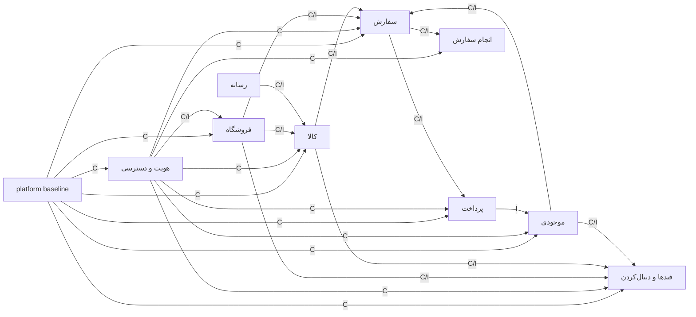

# گراف قراردادها و وابستگی‌های نسخه اول

این سند مرجع canonical قراردادهایی است که سه Spec عمودی نسخه اول بر آن‌ها تکیه
می‌کنند. جدول این سند منبع حقیقت است؛ Mermaid فقط نمای فشرده و مشتق‌شده از
همین جدول است. وضعیت اجرای هر قرارداد و وابستگی در Issueهای GitHub پیگیری
می‌شود و از این سند استنباط نمی‌شود.

این مرجع بر تصمیم‌های زیر بنا شده است:

- [تعیین مرز سه Spec و گراف قراردادها برای کار موازی](https://github.com/Mahaan-Amr/sevomart/issues/60)
- [تثبیت هویت مشترک و مرز نقش‌های خریدار، فروشنده و عامل پلتفرم](https://github.com/Mahaan-Amr/sevomart/issues/50)
- [تثبیت قرارداد کالای فیزیکی، گونه و انتشار عمومی](https://github.com/Mahaan-Amr/sevomart/issues/56)
- [تثبیت قرارداد درخواست فروشندگی، تأیید و ممیزی نقش](https://github.com/Mahaan-Amr/sevomart/issues/57)
- [تثبیت قرارداد دنبال‌کردن و دو فید خریدار](https://github.com/Mahaan-Amr/sevomart/issues/58)
- [تثبیت قرارداد سبد، نشانی، موجودی، سفارش و پرداخت مستقیم](https://github.com/Mahaan-Amr/sevomart/issues/59)

## قواعد خواندن مرجع

- «مالک» تنها ماژولی است که schema، invariant، state machine، خطا و نسخه قرارداد
  را تغییر می‌دهد. «تولیدکننده» operation یا واقعیت ثبت‌شده‌ای است که خروجی را
  می‌سازد.
- `sync` یعنی ادامه همان کار به پاسخ authoritative نیاز دارد. `event` یعنی واقعیت
  ثبت شده و واکنش مصرف‌کننده می‌تواند پس از commit انجام شود.
- `strong` فقط در مرز transaction صریح همان ردیف معنا دارد. projectionها
  `eventual` هستند و هیچ تصمیم عملیاتی به آن‌ها تکیه نمی‌کند.
- `contract-blocks` یعنی مصرف‌کننده پیش از تثبیت artifact نسخه‌دار شروع نمی‌شود.
  `integration-blocks` یعنی ساخت با fake قرارداد مجاز است، اما integration و E2E
  تا اجرای واقعی تولیدکننده متوقف می‌ماند.
- `PII: ندارد` یعنی payload قرارداد، رخداد یا projection داده شخصی حمل نمی‌کند؛
  نه اینکه ماژول مالک هیچ داده شخصی نگه نمی‌دارد. رخداد و projection عمومی هرگز
  شماره موبایل، نام گیرنده، نشانی، متن درخواست، reason text، token، callback خام
  یا metadata خام provider حمل نمی‌کنند.
- قراردادهای دامنه از entrypoint نسخه‌دار مالک منتشر می‌شوند. افزودن سازگار در
  `v1` مجاز است؛ تغییر ناسازگار با `v2` کنار `v1`، مهاجرت مصرف‌کنندگان و سپس حذف
  نسخه قدیم انجام می‌شود.

## جدول canonical

| مالک               | قرارداد و نسخه                                                                                                                                                                                                   | تولیدکننده                                                                  | همه مصرف‌کنندگان شناخته‌شده                                                                           | ارتباط               | consistency                                       | PII در payload                                                             | مرز transaction                                                                              | dependency                                                                            |
| ------------------ | ---------------------------------------------------------------------------------------------------------------------------------------------------------------------------------------------------------------- | --------------------------------------------------------------------------- | ----------------------------------------------------------------------------------------------------- | -------------------- | ------------------------------------------------- | -------------------------------------------------------------------------- | -------------------------------------------------------------------------------------------- | ------------------------------------------------------------------------------------- |
| platform           | شناسه‌های typed، `Money.v1`، `Timestamp.v1`، `ErrorEnvelope.v1` و `EventEnvelope.v1`                                                                                                                             | بسته قراردادهای مشترک                                                       | همه ماژول‌های سه Spec و composerهای OpenAPI/event                                                     | sync/event           | strong در validate؛ envelope رخداد eventual       | ندارد                                                                      | transaction ندارد؛ هر مالک envelope را در transaction خودش به کار می‌برد                     | `contract-blocks` همه قراردادهای پایین‌دست                                            |
| هویت و دسترسی      | `IdentitySession.v1` و `ActorContext.v1`                                                                                                                                                                         | ورود OTP و resolver نشست عمومی                                              | فروشگاه، کالا، موجودی، سفارش، پرداخت، فیدها و دنبال‌کردن، رابط خریدار و فروشنده                       | sync                 | strong                                            | فقط `identityId` و audience؛ موبایل و token ممنوع                          | اعتبارسنجی در مرز HTTP؛ مجوز زنده دوباره در سرویس مالک بررسی می‌شود                          | `contract-blocks` هر سه Spec                                                          |
| هویت و دسترسی      | `SellerAccess.v1`                                                                                                                                                                                                | اعطای فروشندگی و بررسی وضعیت زنده                                           | فروشگاه، کالا، موجودی، سفارش، انجام سفارش و رابط فروشنده                                              | sync                 | strong                                            | ندارد                                                                      | تغییر فروشندگی و audit/outbox مالک اتمیک‌اند                                                 | `contract-blocks` ساخت کالا و عملیات فروشنده؛ `integration-blocks` ورود واقعی فروشنده |
| هویت و دسترسی      | `SellerApplication.v1`                                                                                                                                                                                           | عملیات متقاضی و عامل پلتفرم                                                 | رابط درخواست فروشندگی، رابط عامل و provision فروشگاه                                                  | sync                 | strong                                            | فقط در query مجاز متقاضی/عامل؛ در event ندارد                              | تصمیم، فروشندگی، audit، outbox و provision فروشگاه در یک transaction مشترک                   | platform prerequisite؛ `integration-blocks` دسترسی فروشنده                            |
| هویت و دسترسی      | `SellerApplicationSubmitted.v1`، `SellerApplicationInformationRequested.v1`، `SellerApplicationResubmitted.v1`، `SellerApplicationWithdrawn.v1`، `SellerApplicationApproved.v1` و `SellerApplicationRejected.v1` | ثبت تغییر درخواست فروشندگی                                                  | اعلان‌ها، timeline متقاضی و audit عملیاتی                                                             | event                | eventual، تحویل حداقل یک‌بار                      | ندارد                                                                      | همراه تغییر درخواست در outbox                                                                | platform prerequisite                                                                 |
| هویت و دسترسی      | `SellerAccessActivated.v1`                                                                                                                                                                                       | اعطای فروشندگی فعال                                                         | تجربه و مجوزدهی فروشنده                                                                               | event                | eventual؛ مجوز هر اقدام sync و زنده است           | ندارد                                                                      | همراه فروشندگی و audit در outbox                                                             | platform prerequisite                                                                 |
| هویت و دسترسی      | `PlatformPermissionGranted.v1` و `PlatformPermissionRevoked.v1`                                                                                                                                                  | اعطا یا لغو grant عامل پلتفرم                                               | resolver نشست عامل؛ لغو grant همه sessionهای عامل را فوراً بی‌اثر می‌کند                              | event                | eventual برای اعلان؛ ابطال دسترسی sync است        | ندارد                                                                      | grant، audit و outbox مالک اتمیک‌اند                                                         | platform prerequisite                                                                 |
| هویت و دسترسی      | `IdentityStatusChanged.v1`                                                                                                                                                                                       | فعال یا غیرفعال‌شدن هویت                                                    | projection شمار عمومی دنبال‌کنندگان و resolver همه نشست‌ها                                            | event                | eventual برای projection؛ قطع دسترسی sync است     | ندارد                                                                      | وضعیت هویت، ابطال session، audit و outbox مالک اتمیک‌اند                                     | `integration-blocks` شمار عمومی                                                       |
| فروشگاه            | `ProvisionStoreForApprovedSeller.v1`                                                                                                                                                                             | تأیید درخواست فروشندگی                                                      | هویت و دسترسی                                                                                         | sync                 | strong                                            | نام پیشنهادی فروشگاه تنها داده انسانی مجاز                                 | جدول‌های هر مالک با transaction context مات در یک transaction                                | `contract-blocks` تأیید؛ `integration-blocks` provision واقعی                         |
| فروشگاه            | `StoreAuthoritativeRead.v1` شامل وضعیت انتشار، عضویت، روش ارسال و سیاست مرجوعی نسخه‌دار                                                                                                                          | queryهای فروشگاه                                                            | کالا برای اجازه انتشار؛ سفارش برای ارسال و snapshot سیاست؛ فیدها برای eligibility؛ رابط فروشگاه عمومی | sync                 | strong                                            | policy و اطلاعات عمومی فروشگاه مجاز؛ عضویت و مقصد تسویه عمومی نیست         | read-only؛ snapshot سفارش در transaction سفارش ثبت می‌شود                                    | `contract-blocks` هر سه Spec                                                          |
| فروشگاه            | `StorePublished.v1`، `StoreUnpublished.v1` و `StorePolicyChanged.v1`                                                                                                                                             | انتشار/توقف انتشار یا تغییر سیاست فروشگاه                                   | فیدها و دنبال‌کردن؛ سفارش فقط برای invalidation/refresh داده checkout                                 | event                | eventual                                          | ندارد                                                                      | همراه تغییر فروشگاه در outbox                                                                | `contract-blocks` schema رخداد؛ `integration-blocks` projection فید                   |
| رسانه              | `ProductImageMedia.v1`                                                                                                                                                                                           | upload، پردازش و تحویل مشتق خصوصی/عمومی                                     | کالا و رابط ساخت/نمایش کالا                                                                           | sync                 | strong برای مالکیت؛ مشتق پردازش‌شده eventual      | ندارد                                                                      | تماس object storage خارج از transaction؛ metadata مالک اتمیک                                 | `contract-blocks` ساخت و انتشار کالا؛ `integration-blocks` E2E رسانه                  |
| کالا               | `ProductAuthoring.v1`                                                                                                                                                                                            | ساخت، PUT نسخه کاری، preview، انتشار، توقف انتشار، discard و batch قیمت/SKU | رابط فروشنده                                                                                          | sync                 | strong                                            | ندارد                                                                      | نسخه منتشرشده، `publicationVersion` و outbox اتمیک؛ batchها all-or-nothing                   | قرارداد producer-owned در Spec کالا                                                   |
| کالا               | `ProductAuthoritativeRead.v1`                                                                                                                                                                                    | query جزئیات عمومی و بررسی قیمت/قابلیت فروش                                 | فروشگاه عمومی، سبد، `PrepareCheckout.v1` و `CreateOrder.v1`                                           | sync                 | strong                                            | ندارد                                                                      | read-only؛ سفارش فقط snapshot نتیجه را نزد خودش نگه می‌دارد                                  | `contract-blocks` checkout؛ `integration-blocks` checkout واقعی                       |
| کالا               | `ProductPublished.v1`، `ProductUnpublished.v1` و `VariantPriceChanged.v1`                                                                                                                                        | ثبت انتشار، توقف انتشار یا تغییر offer                                      | فیدها و دنبال‌کردن؛ invalidation سبد/checkout                                                         | event                | eventual و نسخه‌محور                              | ندارد                                                                      | همراه تغییر کالا در outbox                                                                   | `contract-blocks` schema رخداد؛ `integration-blocks` projection فید                   |
| موجودی             | `InventoryAuthoring.v1`                                                                                                                                                                                          | provision صفر و batch اصلاح موجودی با revision                              | رابط فروشنده و کالا هنگام ساخت گونه                                                                   | sync                 | strong                                            | ندارد                                                                      | provision idempotent؛ batch اصلاح all-or-nothing                                             | قرارداد producer-owned در Spec کالا                                                   |
| موجودی             | `InventoryAvailabilityRead.v1`                                                                                                                                                                                   | query موجودی قابل‌فروش گونه                                                 | کالا برای نمایش authoritative؛ سبد و checkout                                                         | sync                 | strong                                            | ندارد                                                                      | read-only                                                                                    | `contract-blocks` checkout؛ `integration-blocks` checkout واقعی                       |
| موجودی             | `InventoryReservation.v1` شامل reserve، commit، release و hold-for-review                                                                                                                                        | workflow ساخت سفارش و تطبیق پرداخت                                          | سفارش و پرداخت                                                                                        | sync                 | strong                                            | ندارد                                                                      | رزرو و ساخت سفارش می‌توانند transaction مشترک داشته باشند؛ provider بیرونی هرگز داخل آن نیست | `contract-blocks` سفارش؛ `integration-blocks` ثبت سفارش و پرداخت واقعی                |
| موجودی             | `VariantAvailabilityChanged.v1`                                                                                                                                                                                  | عبور availability از مرز صفر                                                | فیدها و invalidation نمایش/checkout                                                                   | event                | eventual، idempotent                              | ندارد                                                                      | همراه تغییر موجودی در outbox                                                                 | `contract-blocks` schema رخداد؛ `integration-blocks` projection فید                   |
| موجودی             | `InventoryReserved.v1`، `InventoryCommitted.v1`، `InventoryReleased.v1` و `InventoryHeldForReview.v1`                                                                                                            | تغییر چرخه رزرو موجودی                                                      | سفارش، پرداخت و گزارش عملیاتی                                                                         | event                | eventual، idempotent                              | ندارد                                                                      | همراه تغییر رزرو در outbox                                                                   | `contract-blocks` schema رخداد؛ `integration-blocks` handoff                          |
| سفارش              | `Cart.v1`                                                                                                                                                                                                        | عملیات سبد مهمان/هویت و حل تعارض پس از ورود                                 | رابط خریدار و `PrepareCheckout.v1`                                                                    | sync                 | strong                                            | ندارد                                                                      | هر mutation با revision و idempotency اتمیک                                                  | قرارداد producer-owned در Spec checkout                                               |
| سفارش              | `SavedAddress.v1`                                                                                                                                                                                                | CRUD نشانی نسخه‌دار                                                         | رابط خریدار و `PrepareCheckout.v1`                                                                    | sync                 | strong                                            | دارد؛ فقط همان خریدار و سفارش مجاز                                         | revision نشانی اتمیک؛ snapshot تحویل جداگانه و تغییرناپذیر است                               | قرارداد producer-owned در Spec checkout                                               |
| سفارش              | `PrepareCheckout.v1` و `CreateOrder.v1`                                                                                                                                                                          | workflow checkout و ساخت سفارش                                              | رابط خریدار و پرداخت                                                                                  | sync                 | strong                                            | نشانی فقط در command/query مجاز؛ در event ممنوع                            | سفارش، snapshot، رزرو موجودی و outboxهای دو مالک اتمیک؛ آغاز پرداخت پس از commit             | قرارداد producer-owned؛ به کالا، موجودی و فروشگاه `integration-blocks`                |
| سفارش              | `BuyerOrderRead.v1` و `SellerActionableOrderRead.v1`                                                                                                                                                             | queryهای سفارش                                                              | پیگیری خریدار، فضای کار فروشنده، انجام سفارش و پرونده اختلاف آینده                                    | sync                 | strong                                            | دارد؛ seller فقط در بازه و با مجوز انجام سفارش، reveal دوباره ممیزی می‌شود | read-only؛ reveal دارای audit مستقل                                                          | قرارداد producer-owned در Spec checkout                                               |
| سفارش              | `OrderCreated.v1` و `OrderExpired.v1`                                                                                                                                                                            | ساخت یا انقضای سفارش                                                        | پرداخت، اعلان‌ها و گزارش عملیاتی                                                                      | event                | eventual                                          | ندارد                                                                      | همراه تغییر سفارش در outbox                                                                  | `contract-blocks` schema رخداد؛ `integration-blocks` پرداخت                           |
| سفارش              | `OrderPaymentReviewRequired.v1`                                                                                                                                                                                  | ورود سفارش به بررسی پرداخت                                                  | رابط پیگیری، اعلان‌ها و گزارش عملیاتی                                                                 | event                | eventual                                          | ندارد                                                                      | همراه تغییر سفارش در outbox                                                                  | `contract-blocks` schema رخداد                                                        |
| سفارش              | `OrderBecameActionable.v1`                                                                                                                                                                                       | نهایی‌شدن اتمیک پرداخت و موجودی                                             | انجام سفارش، اعلان‌ها و گزارش عملیاتی                                                                 | event                | eventual؛ consumer idempotent                     | ندارد                                                                      | همراه انتقال سفارش به وضعیت قابل اقدام در outbox                                             | `contract-blocks` schema رخداد؛ `integration-blocks` handoff انجام سفارش              |
| پرداخت             | `DirectPaymentAttempt.v1`                                                                                                                                                                                        | ساخت/خواندن تلاش و اعمال نتیجه معتبر                                        | سفارش، موجودی و رابط خریدار                                                                           | sync                 | strong                                            | callback خام و metadata provider ممنوع؛ reference غیرحساس مجاز             | ساخت تلاش پس از commit سفارش؛ اعمال نتیجه با سفارش و موجودی اتمیک                            | قرارداد producer-owned در Spec checkout                                               |
| پرداخت             | `DirectPaymentProvider.v1`                                                                                                                                                                                       | adapter توسعه یا provider واقعی                                             | پرداخت                                                                                                | sync با سرویس بیرونی | نتیجه provider تا verify غیرقطعی                  | callback ورودی فقط در مرز adapter و هرگز در log/event نیست                 | تماس provider خارج از transaction پایگاه داده                                                | انتخاب و adapter واقعی پیش‌نیاز عرضه MVP؛ adapter توسعه فقط local/test است            |
| پرداخت             | `DirectPaymentAttemptCreated.v1`، `DirectPaymentAttemptDispatched.v1`، `DirectPaymentAttemptConfirmed.v1`، `DirectPaymentAttemptFailed.v1` و `DirectPaymentAttemptReviewRequired.v1`                             | ثبت چرخه تلاش پرداخت                                                        | سفارش، موجودی، اعلان‌ها و گزارش عملیاتی                                                               | event                | eventual؛ نهایی‌سازی مالی idempotent              | ندارد                                                                      | همراه تغییر پرداخت در outbox                                                                 | `contract-blocks` schema رخداد؛ `integration-blocks` تطبیق و handoff                  |
| فیدها و دنبال‌کردن | `StoreFollowing.v1`                                                                                                                                                                                              | PUT/DELETE رابطه دنبال‌کردن                                                 | رابط خریدار و projection شمار دنبال‌کنندگان                                                           | sync                 | strong                                            | `identityId` فقط در command شخصی؛ خروجی فروشنده هویت دنبال‌کننده ندارد     | رابطه، revision مجموعه و outbox اتمیک                                                        | قرارداد producer-owned در Spec کشف                                                    |
| فیدها و دنبال‌کردن | `StoreFollowActivated.v1` و `StoreFollowDeactivated.v1`                                                                                                                                                          | فعال/غیرفعال‌شدن رابطه                                                      | شمار عمومی و invalidation cursor دنبال‌شده‌ها                                                         | event                | eventual، idempotent و نامنفی                     | ندارد                                                                      | همراه رابطه و `followSetRevision` در outbox                                                  | قرارداد producer-owned در Spec کشف                                                    |
| فیدها و دنبال‌کردن | `DiscoveryFeed.v1` و `FollowingFeed.v1`                                                                                                                                                                          | query روی projection کالا/فروشگاه و رابطه دنبال‌کردن                        | رابط خریدار و مهمان؛ following فقط خریدار واردشده                                                     | sync روی read model  | eventual؛ cursor snapshot قطعی و تازگی قابل نمایش | ندارد                                                                      | read-only؛ projection منبع حقیقت عملیاتی نیست                                                | به رخدادهای فروشگاه/کالا/موجودی `integration-blocks`                                  |
| فیدها و دنبال‌کردن | `PublicFollowerCount.v1`                                                                                                                                                                                         | projection رابطه و وضعیت هویت                                               | query فروشگاه عمومی و رابط فروشنده                                                                    | sync روی read model  | eventual با زمان آخرین به‌روزرسانی قابل نمایش     | ندارد                                                                      | read-only؛ فروشگاه نسخه authoritative دیگری نگه نمی‌دارد                                     | به رخداد follow و وضعیت هویت `integration-blocks`                                     |

## مرجع عملیاتی و projection

| مفهوم                           | مرجع حقیقت عملیاتی         | projection مجاز               | تصمیمی که projection حق انجامش را ندارد             |
| ------------------------------- | -------------------------- | ----------------------------- | --------------------------------------------------- |
| فروشگاه و روش ارسال             | فروشگاه                    | کارت/خلاصه فروشگاه در فید     | اجازه انتشار کالا یا اعتبار روش ارسال checkout      |
| مشخصات، قیمت و قابلیت فروش کالا | کالا به‌همراه query موجودی | کارت کالا در دو فید           | افزودن قطعی به سبد یا تأیید قیمت سفارش              |
| موجودی                          | موجودی                     | `availability` کارت فید       | رزرو، مصرف یا جلوگیری قطعی از oversell              |
| سبد، نشانی و سفارش              | سفارش                      | خلاصه پیگیری یا گزارش         | تغییر اقلام، مبلغ، نشانی snapshot‌شده یا وضعیت مالی |
| پرداخت                          | پرداخت                     | نمای وضعیت انسانی سفارش       | حدس موفقیت/شکست یا downgrade نتیجه قطعی             |
| رابطه دنبال‌کردن                | فیدها و دنبال‌کردن         | شمار عمومی و فید دنبال‌شده‌ها | افشای فهرست یا هویت دنبال‌کنندگان                   |

projection عمومی فقط داده لازم برای نمایش را نگه می‌دارد و تازگی آن باید در رابط
با زمان آخرین به‌روزرسانی روشن باشد؛ نام و schema این metadata را Spec مالک
projection تعیین می‌کند. اگر projection خراب یا عقب‌مانده باشد، query فید با
`503` و `Retry-After` شکست می‌خورد؛ نتیجه ساختگی یا تصمیم عملیاتی بر پایه داده
قدیمی مجاز نیست.

## یال‌های blocking و نقاط fan-out

| تولیدکننده → مصرف‌کننده      | artifact لازم                                                      | نوع یال                                    | نتیجه عملی                                                                     |
| ---------------------------- | ------------------------------------------------------------------ | ------------------------------------------ | ------------------------------------------------------------------------------ |
| platform → همه ماژول‌ها      | envelopeهای مشترک، entrypoint نسخه‌دار، composer و outbox baseline | `contract-blocks`                          | هیچ Spec قرارداد مشترک محلی یا barrel برخوردپذیر نمی‌سازد.                     |
| هویت و دسترسی → هر سه Spec   | session/actor و وضعیت زنده هویت                                    | `contract-blocks`                          | مجوز و actor از ابتدا یک معنا دارند.                                           |
| اعطای فروشندگی → فروشگاه     | provision اتمیک فروشگاه و عضویت مالک                               | `integration-blocks`                       | ساخت با fake مجاز است؛ ورود و E2E فروشنده منتظر implementation واقعی می‌ماند.  |
| فروشگاه و رسانه → کالا       | وضعیت انتشار فروشگاه و رسانه محصول                                 | `contract-blocks` سپس `integration-blocks` | schema پیش از ساخت ثابت و E2E انتشار منتظر adapter واقعی است.                  |
| کالا → سفارش                 | قیمت و قابلیت فروش authoritative                                   | `contract-blocks` سپس `integration-blocks` | checkout با fake ساخته می‌شود، اما integration قیمت واقعی منتظر کالا است.      |
| موجودی → سفارش/پرداخت        | availability و رزرو/مصرف                                           | `contract-blocks` سپس `integration-blocks` | oversell و handoff فقط با implementation واقعی آزموده می‌شوند.                 |
| فروشگاه → سفارش              | روش ارسال و سیاست مرجوعی نسخه‌دار                                  | `contract-blocks` سپس `integration-blocks` | سفارش snapshot را تکرار می‌کند، نه قرارداد مالک را.                            |
| فروشگاه/کالا/موجودی → فیدها  | رخدادهای عمومی نسخه‌دار                                            | `contract-blocks` سپس `integration-blocks` | ranking با fixture ساخته می‌شود؛ projection واقعی منتظر outbox تولیدکننده است. |
| دنبال‌کردن/هویت → شمار عمومی | رخداد رابطه و وضعیت هویت                                           | `integration-blocks`                       | شمار فقط active identity + active relation را نشان می‌دهد.                     |
| سفارش → انجام سفارش          | `OrderBecameActionable.v1`                                         | `contract-blocks` سپس `integration-blocks` | پرداخت و موجودی participantهای بالادست‌اند؛ فقط سفارش handoff را منتشر می‌کند. |

نقاط fan-out نسخه اول عبارت‌اند از: هویت و actor به هر سه Spec؛ وضعیت فروشگاه به
کالا، checkout و فید؛ انتشار/قیمت/availability کالا به checkout و فید؛ نتیجه
پرداخت به سفارش و موجودی؛ و `OrderBecameActionable.v1` از سفارش به انجام سفارش.
مالک producer schema را یک‌بار منتشر می‌کند و هر مصرف‌کننده contract test خودش
را نگه می‌دارد.

## گراف مشتق‌شده

این گراف فقط یال‌های جدول بالا را خلاصه می‌کند؛ جهت پیکان از producer به consumer
است و `C` و `I` به‌ترتیب `contract-blocks` و `integration-blocks` هستند.

## پیش‌نیازهای platform

این موارد Spec چهارم نیستند. یک baseline تک‌مالک باید پیش از fan-out سه مسیر روی
SHA مشترک ادغام شود:

1. Prisma به schemaهای ماژول‌محور چندفایلی شکسته شود؛ generator و datasource
   مرکزی فقط در مالکیت platform بمانند.
2. migration هر ماژول در پوشه و نام‌گذاری همان ماژول افزوده شود؛ هم‌زمان فقط یک
   Issue schema یا migration یک ماژول را تغییر دهد.
3. هر دامنه entrypoint مستقل و نسخه‌دار در `@sevo/contracts` داشته باشد؛ package
   export و barrel مرکزی پیش از fan-out slotهای لازم را بگیرند.
4. هر ماژول fragment و operations متعلق به خودش را برای OpenAPI نگه دارد و
   composer مرکزی فقط در مالکیت platform باشد.
5. outbox envelope، زیرساخت persistence برای idempotency بدون قاعده دامنه‌ای
   مشترک، transaction context مات و architecture testهای import/مالکیت داده پیش
   از integration واقعی آماده باشند. هر ماژول operation scope، replay و conflict
   قرارداد idempotency خودش را مالک می‌ماند.
6. session مشترک هویت، اعطای فروشندگی و provision اتمیک فروشگاه قرارداد بسته
   داشته باشند. fake می‌تواند ساخت مصرف‌کننده را باز کند، نه E2E واقعی را.

### مالکیت فایل‌های مرکزی

| سطح           | فایل یا خانواده فایل                                                  | مالک تغییر                    | قاعده fan-out                                                                                     |
| ------------- | --------------------------------------------------------------------- | ----------------------------- | ------------------------------------------------------------------------------------------------- |
| Prisma مرکزی  | generator/datasource در `packages/database/prisma/schema/base.prisma` | platform baseline             | schema ماژول‌ها در فایل هم‌نام زیر `prisma/schema/` است و فقط مالک همان ماژول آن را تغییر می‌دهد. |
| migration     | `packages/database/prisma/migrations/<module>__*`                     | مالک موقت همان ماژول در Issue | دو شاخه migration یا جدول یک ماژول را هم‌زمان تغییر نمی‌دهند.                                     |
| قرارداد مرکزی | `packages/contracts/package.json` و export/barrelهای مشترک            | platform baseline             | slotهای entrypoint پیشاپیش ساخته می‌شوند؛ Specها barrel مرکزی را ویرایش نمی‌کنند.                 |
| قرارداد دامنه | `@sevo/contracts/<module>/v1`                                         | مالک موقت ماژول producer      | فقط producer schema، خطا و event خودش را تغییر می‌دهد.                                            |
| OpenAPI مرکزی | composer و bootstrap مشترک زیر `apps/api/src/openapi/`                | platform baseline             | module fragment/operations پیشاپیش slot دارد؛ مصرف‌کننده composer را تغییر نمی‌دهد.               |
| OpenAPI ماژول | fragment و operations همان ماژول                                      | مالک موقت ماژول producer      | تغییر همراه contract/compatibility test همان مالک است.                                            |

تغییر runtime، schema، migration، بسته قراردادها یا OpenAPI در این Issue انجام
نمی‌شود؛ جدول بالا فقط مالکیت و ترتیب اجرای آن تغییرهای آینده را ثبت می‌کند.

## قالب مشترک سه Spec

هر سه فایل زیر از همین ترتیب استفاده می‌کنند:

- `docs/specs/physical-product-authoring-and-publication.md`
- `docs/specs/cart-order-direct-payment.md`
- `docs/specs/discovery-and-store-following.md`

### ۱. نتیجه و کار اصلی

- کار اصلی کاربر و نتیجه قابل مشاهده را در یک جمله بنویسید.
- خریدار و فروشنده را جداگانه بررسی کنید، حتی اگر یکی فقط مصرف‌کننده اثر باشد.

### ۲. محدوده و خارج از محدوده

- رفتارهای درون برش و رفتارهای عمداً عقب‌افتاده را فهرست کنید.
- قابلیت آینده، provider واقعی یا projection تحلیلی را وارد مسیر امروز نکنید.

### ۳. واژگان، actorها و مجوز

- فقط واژگان `CONTEXT.md` را به کار ببرید.
- audience نشست، بررسی مجوز زنده، رفتار `401/403/404` و مرز مالکیت منبع را روشن
  کنید.

### ۴. جریان اصلی و شکست‌ها

- happy path را قدم‌به‌قدم و سپس transition نامعتبر، تعارض revision، replay،
  timeout، داده stale و شکست provider/projection را بنویسید.
- قدم بعدی و متن حساس اعتماد یا پرداخت برای کاربر روشن باشد.

### ۵. state، invariant و transaction

- فقط state machine و invariant متعلق به همان Spec را تعریف کنید.
- مرز transaction، consistency، outbox، قواعد idempotency متعلق به همان مالک و
  تماس بیرونی پس از commit را ثبت کنید.

### ۶. قراردادهای تولیدی

- operation، query، خطا و eventهایی را که ماژول‌های این Spec مالک‌اند با نسخه،
  producer، consistency، PII و compatibility policy تعریف کنید.
- این بخش باید به ردیف‌های همین جدول لینک دهد و با آن تعارض نداشته باشد.

### ۷. قراردادهای مصرفی و یال‌ها

- قرارداد producer-owned را بازنویسی نکنید؛ به ردیف canonical آن ارجاع دهید.
- برای هر مصرف، `contract-blocks` یا `integration-blocks`، fake مجاز و شرط حذف
  fake را ثبت کنید.

### ۸. مالکیت داده، فایل و migration

- ماژول، جدول، migration، contract entrypoint، OpenAPI fragment، route group و
  تست‌های تحت مالکیت Issueهای ساخت را مشخص کنید.
- فایل مرکزی لازم را به baseline تک‌مالک منتقل کنید؛ Spec مصرف‌کننده مالک آن نیست.

### ۹. PII، حریم خصوصی و observability

- داده مجاز در command/query را از داده ممنوع در event، projection، log، trace و
  fixture جدا کنید.
- correlation، metric، alert و audit لازم را بدون payload حساس تعریف کنید.

### ۱۰. معیار پذیرش و برش Issueها

- معیارهای unit، integration با PostgreSQL، contract/compatibility، E2E، RTL،
  موبایل، keyboard focus، کنتراست و reduced motion را بنویسید.
- برش‌های کوچک ساخت، فایل‌های اصلی، مالک موقت، SHA پایه و dependency هر Issue را
  پیشنهاد دهید؛ Issue ساخت فقط پس از کامل‌شدن Spec ایجاد و claim شود.

## کنترل همگام‌سازی

پیش از شروع هر Issue ساخت، کار قبلی با PR مستقل ادغام، تغییر commit‌نشده در شاخه
مالک خودش حفظ، `origin/main` دریافت و بررسی‌های مرتبط سبز می‌شود. هر دو
توسعه‌دهنده شاخه تازه را از SHA مشترک ثبت‌شده در Issue می‌سازند. انتقال مالکیت
فقط در Issue ثبت می‌شود و هیچ فایل مرکزی یا قرارداد producer-owned هم‌زمان در دو
شاخه تغییر نمی‌کند.
